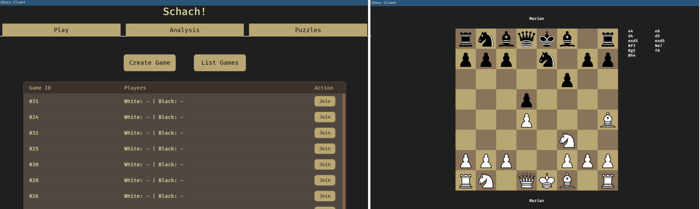
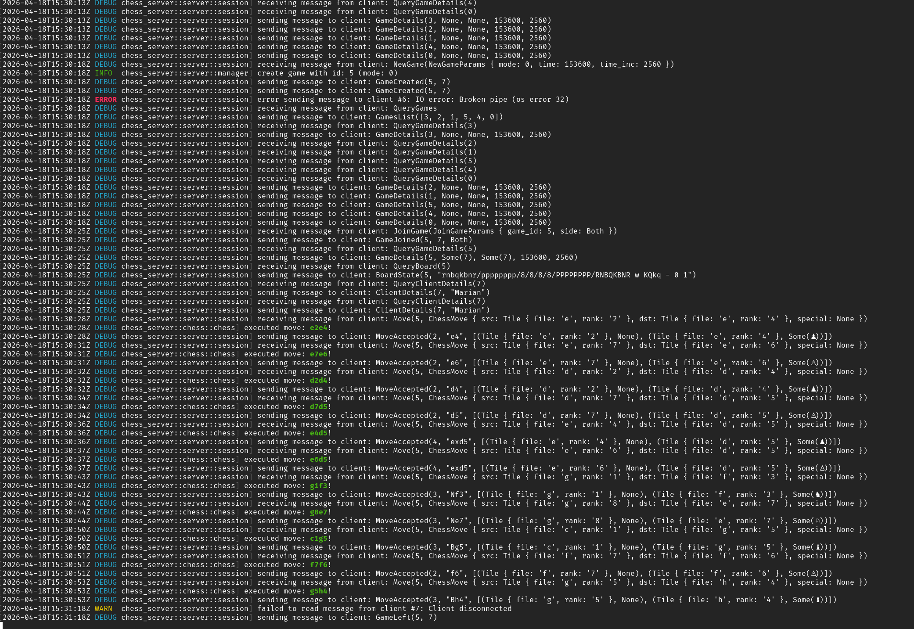

# Chess-Server (+ Bevy Client)

My personal 'everyone needs to write a chess program in his life' attempt.

A chess program as a client-server architecture. The server is responsible for all the chess logic while clients can send commands to create, join and play chess games.

Could evolve in either a small-sized online chess or a chess analysis software if I will ever care enough.

### Done:

- [x] Client-Server Architecture:
  - [x] Basic Management for multiple games and clients
  - [x] Protocol for communicating online-chess-related messages (hosting games, making moves, ...)

- [x] All mandatory rules for a chessgame:
  - [x] All Piece logic
  - [x] Checkmate and Stalemate detection
  - [x] 50-Moves-Rule
  - [x] Threefold-Repetition

- [x] Basic GUI Client:
  - [x] Create, Join and List Games
  - [x] Move Pieces, Promote
  - [x] Response to opponent moves, game over, etc.

- [x] SAN converter

- [x] Nicknames

### Short/Mid-Term TODO:

- [ ] Better Client with better GUI

- [ ] Insufficient Material Draw

- [ ] Offer Draw

- [ ] Resigning

- [ ] Move history

- [ ] Time control management

- [ ] Material overview

### Long-Term TODO:

- [ ] Persistent Accounts

- [ ] Puzzles

- [ ] Analysis

- [ ] UCI Bridge (Stockfish integration)
